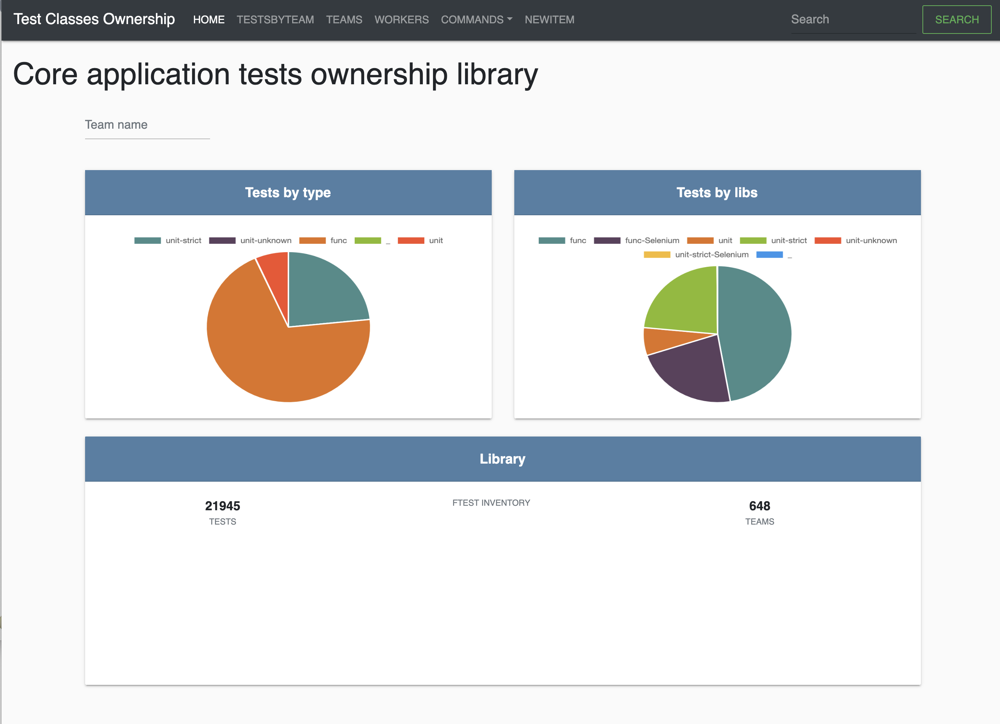
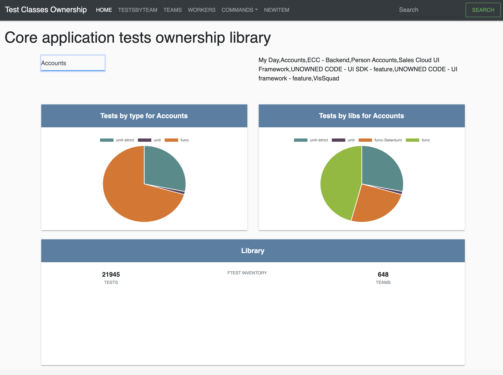
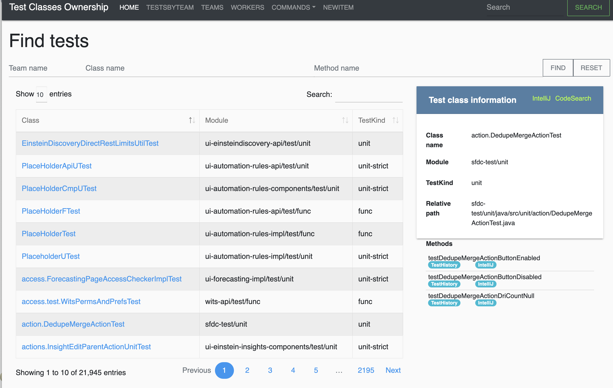

# Test Registry

This utility analyses the sources and provides interface to the database which holds information about test classes in the Core and the respective systems about ownning teams.

The supported ownership systems:
* Generic files
  * ownership.yaml files
* Java
  * Java annotation @Owner
  * Java annotation @ScrumTeam
* Java Tests
  * Java annotation @Owner
  * Java annotation @ScrumTeam
  * FTest Inventory XML files

It also evaluates the code in Java and attempts to identify used Frameworks and Browsers if Selenium is detected.
* unit
* unit-strict
* func (Functional tests)
  * Selenium
    * Aloha
    * SFX
    * S1
* Frameworks:
  * Mockito1
  * Mockito2
  * PowerMock
  * LPOP
  * BaseUITest
  * BlackTabTest

Home page with the overview of detected teams, tests and their categories:


Home page with the overview of tests by specific team name, tests and their categories:


List of tests by team:


###Internal data
The stored information about the test class, which reveals the discrepancy between different source of ownership:
`sfa/WebToLeadDataPETest.yaml`
```yaml
classInfo:
  owners:
    Sales Cloud Leads Team:
      - ScrumTeam class annotation
    Accounts:
      - Ownership.yaml
  labels: {}
  ownersPartial: {}
methodsInfo:
  testNoMarketingLicense:
    name: testNoMarketingLicense
    owners: {}
    labels: {}
ignoredMethods:
  - ftestSetUp
class: sales.lead.WebToLeadDataPETest
module: sfa/test/func
testKind: func
relative: sfa/test/func/java/src/sales/lead/WebToLeadDataPETest.java
```
Example of test information with some methods marked IN_DEV (in development):

```yaml
classInfo:
  owners:
    Accounts:
      - Ownership.yaml
  labels: {}
  ownersPartial: {}
  partialIN_DEV:
    - testNoError
methodsInfo:
  testNoError:
    name: testNoError
    owners: {}
    labels:
      IgnoreFailureReason.IN_DEV:
        - TestLabel method annotation
    IN_DEV: true
ignoredMethods:
  - ftestSetUp
  - ftestTearDown
class: system.security.csrf.OpportunityListCSRFSeleniumTest
module: sfa/test/func
testKind: func
relative: sfa/test/func/java/src/system/security/csrf/OpportunityListCSRFSeleniumTest.java
```
